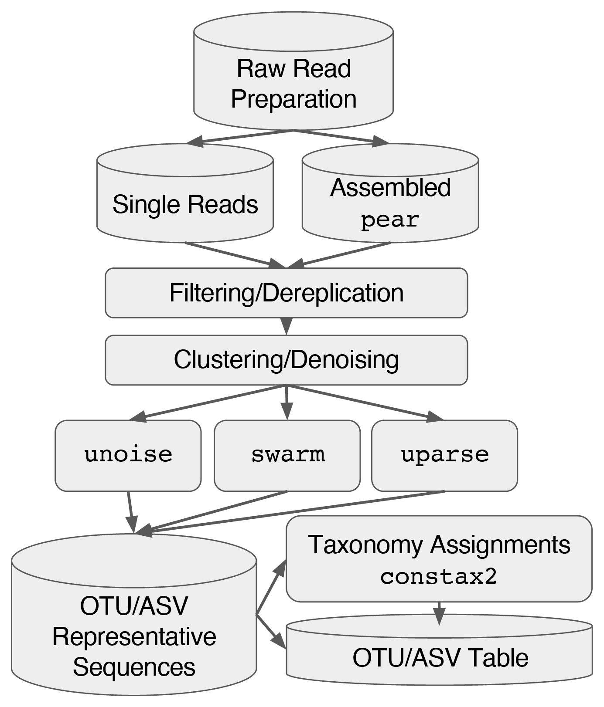

# **Hi, I am Cecilia!**

## *Cecilia v.1.0* - usear**C**h bas**E**d ampli**C**on p**I**pe**L**ine for **I**llumina d**A**ta<br> 
<br>



written by Gian M N Benucci, PhD<br>
email: *benucci@msu.edu*<br>
August 22, 2022

*This pipeline is based upon work supported by the Great Lakes Bioenergy Research Center, U.S. Department of Energy, Office of Science, Office of Biological and Environmental Research under award DE-SC0018409*

> __Warning__<br>
> ### **This pipeline was born for running on the `HPCC` at Michigan State University which run the SLURM (Simple Linux Utility for Resource Management) job scheduler system. If you want to run this piepline in any other systems it will require modification of the main, as well as, the accessory scripts.**

### **Installation**

To use Cecilia just clone the directory 
```
git clone https://github.com/Gian77/Cecilia.git

```
You will then need to 
* Copy your raw reads file in the rawdata directory together with a md5sum file.
* Install all the necessary tools through `conda` (please see the complete list of tools reported below).
* Download the databases (please see below and the `config.yaml` file), and include the full paths into the config file.
* Select all the **User options** (please see below).

### **Let's explore the settings in the `config.yaml` file**

#### **Directories**

The main project's directory is: `project_dir="/mnt/home/benucci/Cecilia`. Of course, you will need to adjust the path to your HPCC user name. 

> __Note__ <br> 
> * This pipeline run using SLURM (please see bove). **Resourches of each individual job scripts present in the `/mnt/home/benucci/Cecilia/code/` directory MUST be adjusted to the amount of data you want to run for each pipeline run.** In particular the parameters below.
> ```
> #SBATCH --time=00:10:00
> #SBATCH --nodes=1
> #SBATCH --ntasks=1
> #SBATCH --cpus-per-task=8
> #SBATCH --mem=16G
> ```
> Data MUST be demultiplexed and all *R1* and *R2* read files copied in the `$project_dir/rawdata/` directory, alongside a `md5sum` checksum file names `md5.txt`.
> * The individual scripts in the `code` directory include the buy-in node priority `#SBATCH -A shade-cole-bonito`. If you do not have access to those priority nodes please remove that line in the individual scripts.
> * You can change the name of the `$project_dir`, but by default is going to be `Cecilia`. Subdirectories such as `outputs` and `slurms` are part of the workflow, and should be left as they are.
> * Please check the config file for options. A few script are additional and are can be avoided to save time.<br>
> * The directory called `condaenvs` contain all the `yml` files you can use to recreate the exat conda environment used to run constax2. To create a conda environment based on a recipe you can do: `conda env create -f environment-name.yml`. The only environment needs to be created from scratch is the R environemt. Make sure you have the `r-tidyverse` package installed. <br>

#### **Databases**
```
# Markers gene sequence databases in the general format. Find a good PATH for your databases.
euk_db="/mnt/research/ShadeLab/Benucci/databases/unite_euk21/sh_general_dynamic_euk_10052021_dev.fasta"
bac_db="/mnt/research/ShadeLab/Benucci/databases/silva_db138/SILVA_138_SSURef_tax_silva_bact_arch.fasta"

bonito_isolates="/mnt/home/benucci/CONSTAX_v2/isolates_bonitolab2021.fasta"
phix_db="/mnt/research/ShadeLab/Benucci/databases/phix_index/my_phix"
```
#### Cecilia run-related mandatory parameters
This below is an example of parameter for a Cecilia run. Before you fill this up there are impotant things to consider:
* Data must be previously demultiplexed. Usually 1 sample has 2 sequence files, forward (i.e. R1) and reverse (i.e. R2). 
* All logical variables are case sensitive and must be `yes` or `no`.
* Other variables are numeric (or float) and can be decided by the user.
* Values for `R1` and `R2` are always required when assembling the reads, otherwise you should specify which read you want to use, *just `R1` or `R2` but not both*. If you want to run the analysis for both reads then you wil run Cecilia twice. 
* `ITS`, `18S` or `16S` are the allowed markers for now. However if you have 18S data you must have an eukaryotic database as the one form the [UNITE](https://unite.ut.ee/).
* In `stripleft` you must specify the number of bp to strip (cut off) the reads.

```
DNAmarker=ITS
primers=yes
R1=yes
R2=yes
assemble=yes
min_overlap=50
rename=yes
stripleft=no
stripleft_bp=0
max_Eerr=1.0
test_length=yes
user_only=no
user_length=300
cluster_otu=yes
cluster_asv=yes
cluster_swarm=no
```

Then you need set the constax2 parameters. You need to add the constax PATHs to make the tool to run correctly. 

```
SINTAX=/mnt/research/rdp/public/thirdParty/usearch11.0.667_i86linux64
RDP=/mnt/home/benucci/anaconda2/envs/constax2/share/rdptools-2.0.3-1/classifier
CONSTAX=/mnt/home/benucci/anaconda2/envs/constax2/opt/constax-2.0.19-0
train_db=no
trainfiles_euk="/mnt/research/ShadeLab/Benucci/databases/unite_euk21/trainfiles_unite10052021"
trainfiles_bac="/mnt/research/ShadeLab/Benucci/databases/silva_db138/trainfiles_silva138"
constax_conf=0.7
```
Most of the variables are are sefl explanatory, usually boolean, so they take two values `yes` or `no`. For example, the `R1` and `R2` variables are the forward and reverse read coming out from the Illumina machines. Others are numeric (i.e. float), for example, `min_overlap`, `max_Eerr`, and `constax_conf`, which represent the minimum overlap size, the maximim number of expected errors to use in [USEARCH]()https://www.drive5.com/usearch/) for filtering, and the cutoff value to use in the taxonomy assignments in [CONSTAX2](https://github.com/liberjul/CONSTAXv2). Some take different strings, for example, the `DNAmarker` variable accepts 3 values, `ITS`, `18S`, or `16S`. This variable tells Cecilia what type of marker we have sequenced. Others represent the full paths to certaian directories or files. For example, the `trainfiles_bac` is where the CONSTAX2 reference database training files will be saved. In some cases reads are already removed of the PCR primers and adapters, which extends further out from them, specify if primers are present with `primers`.

> **_IMPORTANT NOTE_**<br>
>Ceclia generates several files that are used for double checking the results, if all the processes performed as we expected, and if there is something we can improve by changing any of the parameters described above. In particular:
>* the `$project_dir/outputs/06_primerStrip_cutadapt/` directory will contain a subset of the reads where primers and adapters have been removed. I suggest you open that file with an alignment too e.g. [SeaView](https://doua.prabi.fr/software/seaview), to see if the stripping was efficient across reads.
>* the `$project_dir/outputs/08_testLength_usearch` directory will contain the `testLength.results` file that has the number of filtered reads, uniques, and OTUs numbers at each bp of length, from reads trimmed at 150bp to 300bp. If you do not see OTUs (or very few), do not freak out, it can be that most of reads are shorter than 150bp. Check the `$project_dir/outputs/07_readTrimDemux_usearch/eestats2.results` file if that is your case.
>* Most importantly all the pipeline results and reports will be saved in a *tar.gz* file in the `$project_dir/outputs/16_getStats-bash/`.


#### **PCR primers.**
Remember to uncomment the primers that were used in your study, and if you have used a different set of primers, just add it to the `config.yaml` file.
```
#fwd_primer="TATYGYTCTTNAACGAGGAATC" # amf fwd primer (Author here)
#rev_primer="AACACTCGCAYAYATGYTAGA" # amf rev primer
#rev_primer_RC="TCTARCATRTRTGCGAGTGTT" # amf rev compl

#fwd_primer="CTTGGTCATTTAGAGGAAGTAA" # ITS1F fwd primer (Gardes & Bruns 1993)
#rev_primer="TCCTCCGCTTATTGATATGC" # ITS4 rev primer (White et al. 1990)
#rev_primer_RC"=GCATATCAATAAGCGGAGGA" # ITS4 rev compl

#fwd_primer="CTTGGTCATTTAGAGGAAGTAA" # ITS1F fwd primer (White et al. 1990)
#rev_primer="GCTGCGTTCTTCATCGATGC" # ITS2 rev primer (White et al. 1990)
#rev_primer_RC="GCATCGATGAAGAACGCAGC" # ITS2 rev compl

#fwd_primer="GGAAGTAAAAGTCGTAACAAGG" # ITS5 fwd primer (White et al. 1990)
#rev_primer="GCTGCGTTCTTCATCGATGC" # ITS2 rev primer (White et al. 1990)
#rev_primer_RC="GCATCGATGAAGAACGCAGC" # ITS2 rev compl

fwd_primer="GTGCCAGCMGCCGCGGTAA" # 515F fwd primer (Parada et al., 2016 modified by Caporaso)
rev_primer="GGACTACHVGGGTWTCTAAT" # 806R rev primer (Apprill et al., 2015. modified by Caporaso)
rev_primer_RC="ATTAGAWACCCBDGTAGTCC" # 806R rev compl 
```
Useful links to lookup primers sequences:
* https://earthmicrobiome.org/protocols-and-standards/16s/
* https://unite.ut.ee/primers.php

### **To fully run Cecilia on HPCC you need:**
Please install via conda (or use the binaries in the HPPC) of all these software below
* ##### [Fastqc](https://www.bioinformatics.babraham.ac.uk/projects/fastqc/)
* ##### [Cutadapt](https://cutadapt.readthedocs.io/en/stable/)
* ##### [Bowtie2](https://bowtie-bio.sourceforge.net/bowtie2/index.shtml)
* ##### [USEARCH](https://www.drive5.com/usearch/)
* ##### [SWARM](https://github.com/torognes/swarm)
* ##### [CONSTAX2](https://constax.readthedocs.io/en/latest/)
* ##### [seqtk](https://github.com/lh3/seqtk)

> **_IMPORTANT NOTE_**<br> 
>For [USEARCH](https://www.drive5.com/usearch/) or [VSEARCH](https://github.com/torognes/vsearch) you do not need a coda install, you can just download the binaries. At MSU we have multiple USEARCH licenses that were purchased and some belong to GLBRC. However, check if your lab is one of those that purchased the license befor eusing the tool. If so, USEARCH v11 in the MSU HPCC is at: `/mnt/research/rdp/public/thirdParty/usearch11.0.667_i86linux64`

### **Acknowledgements**
This pipeline is dedicated to my friend's daugther Cecilia.
Many thanks to the Institute for Cyber-Enabled Research (ICER) for helping troubshoting SLURM, Research Technology Support Facility (RTSF) [Genomics Core](https://rtsf.natsci.msu.edu/genomics/) at Michigan State University (MSU) for sequencing the data, Dr. Greg Bonito and the whole [Bonito lab](https://www.canr.msu.edu/bonitolab/) at MSU for brainstorming over methods and tools, my good friend and colleague Dr. Livio Antonielli at the [AIT Austrian Institute of Technology GmbH](https://www.ait.ac.at/en/) for always answering my uncountable bioiformatic questions and for giving me a baseline code from where to start this project, and my friends Dr. Kristi MacCready and Dr. Zachary Noel for the million discussion about microbiomes and how to best analyze them.

